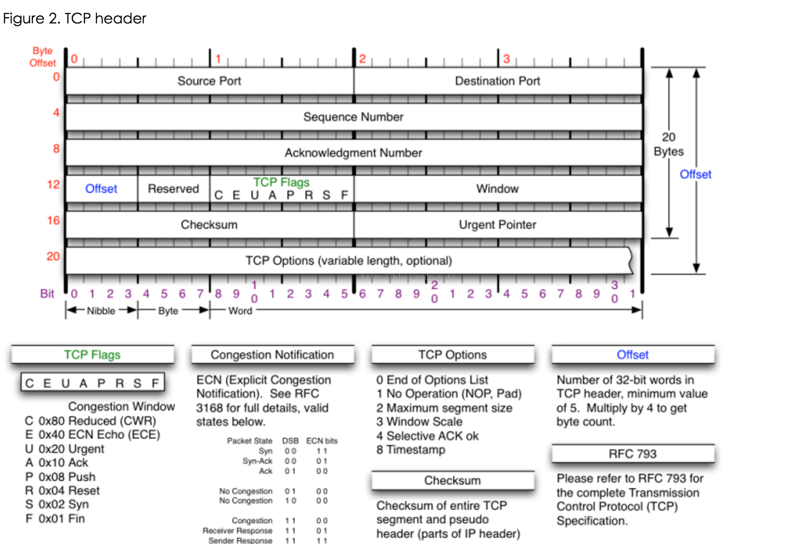

# 一 特性
## 1.1 字节流
  什么是字节流呢？
## 1.2 面向连接
  客户端和服务器在传输数据之前，必须先建立一个TCP连接。
## 1.3 超时重传

## 1.4 流量控制
  由于客户端和服务端处理数据的能力不同，所以数据发送方和数据接收方都有固定的缓冲区大小。
  发送数据时，最多只能发送接收端缓存区允许的大小，从而避免缓冲区溢出问题。
## 1.5 全双工
  客户端和服务器可以同时向对方发送数据。

# 二 TCP头部
## 2.1 长度
  TCP头部由20个字节的固定长度+可选的选项字段组成。
  所以，TCP头部长度范围为：[20,60]
## 2.2 头部组成
